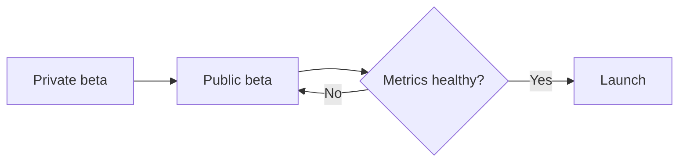
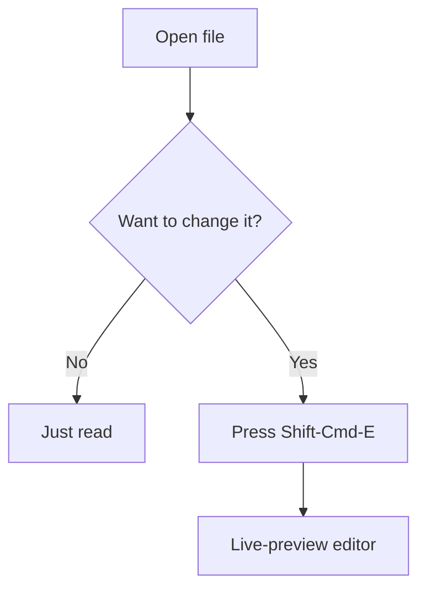

# Gloss Demo Walkthrough & App Store Preflight

**One document, two jobs.** Followed top to bottom, it demos every Gloss feature with a purpose-built vault — use it to give a demo, record a video, or capture App Store screenshots. Every step is also a checkbox, so a completed pass doubles as the pre-submission verification that the app does everything the App Store listing says it does.

**Version under test:** 1.20.2 (signed DMG: `macos/Gloss-1.20.2.dmg`, built 2026-07-04).
**Time:** ~90 minutes for a full pass. Parts 1–2 alone (~20 min) cover the free tier.
**Requirements:** a Mac with the DMG, network access (three rendering libraries load from CDN), and an Apple ID that owns — or can purchase/sandbox-purchase — Gloss Pro.

> **Meta:** this file is itself markdown. Open it *in Gloss* and it becomes its own demo — the frontmatter above appears in the Inspector, these checkboxes are clickable, and the code blocks below grow copy buttons.

> ⚠️ **Quirk (critical): test from the DMG, not from source.** SPM/`swift run` builds compile with `isUnlocked = true`, no StoreKit, and no Quick Look extension (`#if !XCODE_BUILD`, `StoreManager.swift`). The paywall, purchase flow, unlock cache, and Quick Look can **only** be verified in the signed Xcode build. Also quit any running copy of Gloss first — launching a same-bundle-id build while another is running just re-activates the old one.

---

## What Gloss is (the demo pitch)

> **Like Preview.app, but for markdown.** Opens to read; edits when you ask.

Every other markdown tool drops you into an editor. Gloss opens into a clean, rendered, *reading* view — and it's one keystroke (⇧⌘E) to a live-preview editor when you actually want to change something. Around that reader-first core sits a full local knowledgebase: wiki-links, backlinks, tags, queries, a link graph, daily notes, and quick capture — all in plain markdown files on disk, indexed into a local SQLite database, with no account, no subscription, and no telemetry.

### Five use cases this walkthrough demos

| Use case | Where it shows up |
| --- | --- |
| **Reading a repo's docs** — READMEs, CLAUDE.mds, changelogs, rendered instead of raw | Parts 2, 3 (doc-type icons), 8 (CLI: `gloss .`) |
| **A personal knowledgebase** — typed wiki-links, backlinks, tags, queries, graph | Parts 5–6 |
| **Meeting & field notes** — daily notes, hot-corner quick capture, fillable templates | Parts 6–7 |
| **Reviewing AI/tool-generated markdown** — live reload shows edits as they land | Part 2 (live reload), Part 8 (CLI) |
| **Finder-first triage** — spacebar Quick Look, then hand off to your real editor | Part 8 |

---

## Part 0 — Setup

- [ ] **Install the build under test.** On the target Mac: quit Gloss if running, open `macos/Gloss-1.20.2.dmg`, drag Gloss to `/Applications`, launch once, and click through Gatekeeper.
- [ ] **Confirm notarization** (Terminal, any directory, on the target Mac):

```bash
spctl -a -vv /Applications/Gloss.app
# expect: accepted, source=Notarized Developer ID
```

- [ ] **Scaffold the demo vault.** Copy the block below into Terminal (any directory, target Mac). It creates `~/GlossDemo` — 15 markdown files + 1 image that exercise every feature, with predictable expected results. It refuses to overwrite an existing folder.

````bash
#!/bin/bash
# Gloss demo vault scaffold — creates a small vault exercising every Gloss feature.
# Usage: bash make-demo-vault.sh [target-dir]   (default: ~/GlossDemo)
set -euo pipefail

VAULT="${1:-$HOME/GlossDemo}"
if [ -e "$VAULT" ]; then
  echo "Refusing to overwrite existing path: $VAULT" >&2
  exit 1
fi

mkdir -p "$VAULT"/{Projects,Research,Decisions,Meetings,Templates,"Reference/assets","Edge Cases"}

cat > "$VAULT/Start Here.md" << 'EOF'
---
title: Start Here
tags: [hub, demo]
status: active
owner: Michael
updated: 2026-07-06
---

# Start Here

Welcome to the **Gloss demo vault** — a tiny knowledgebase built to exercise
every feature in the app. Everything here is fictional; the Foxtail Labs team
is preparing to launch a product called Apollo.

## Tour the vault

- [[Apollo Launch]] — the flagship project note
- [[Zephyr Redesign]] — a second project, currently paused
- [[Market Notes|the market research]] — an aliased wiki-link
- [[Launch Plan::depends]] — a *typed* wiki-link (this note depends on the plan)
- [[Dashboard]] — live queries over this vault
- [[Syntax Showcase]] — every rendering feature on one page

## Checklist for today

- [x] Scaffold the demo vault
- [ ] Follow the walkthrough top to bottom
- [ ] Capture App Store screenshots along the way

## Embedded from the research

The block below is *transcluded* from another note with `![[Market Notes#Key Findings]]`:

![[Market Notes#Key Findings]]
EOF

cat > "$VAULT/Dashboard.md" << 'EOF'
---
title: Dashboard
tags: [dashboard]
---

# Dashboard

Each block below is a live **md+ query** over the vault's link index.

## Active projects

Expected: **Apollo Launch** and **Launch Plan** (both `status: active` + tagged `project`); Zephyr is paused and must not appear.

<!--md+
type: query
title: Active projects
tag: project
where:
  status: active
sort: title
order: asc
-->

## Research notes

Expected: **Competitor Brief** and **Market Notes**.

<!--md+
type: query
title: All research
tag: research
sort: modified
order: desc
-->

## Who points at Apollo?

Expected: the six notes that link to Apollo Launch — Start Here, Launch Plan, Zephyr Redesign, Competitor Brief, ADR-001 One-Time Pricing, and the kickoff meeting note. (This dashboard deliberately avoids wiki-linking Apollo, so it stays out of its own results.)

<!--md+
type: query
title: Everything linking to Apollo
links-to: Apollo Launch
sort: title
-->
EOF

cat > "$VAULT/Launch Plan.md" << 'EOF'
---
title: Launch Plan
tags: [project, plan]
status: active
priority: 1
---

# Launch Plan

This plan [[Apollo Launch::implements|implements the Apollo project]].
The filename contains "plan", so the sidebar shows the map icon for it.

## Phases



## Milestones

- [x] Beta invite list drafted
- [ ] Press kit assembled
- [ ] Launch-day runbook rehearsed
EOF

cat > "$VAULT/README.md" << 'EOF'
# Gloss Demo Vault

This folder is generated by the Gloss demo walkthrough. It exists to exercise
every feature of the app: wiki-links (plain, aliased, typed), transclusion,
tags, frontmatter properties, md+ queries and templates, and the full
rendering pipeline.

Safe to delete at any time. Regenerate it with the scaffold script in
`docs/DEMO_WALKTHROUGH.md` in the Gloss repo.
EOF

cat > "$VAULT/CHANGELOG.md" << 'EOF'
# Changelog

## 0.2.0 - 2026-07-06
- Added the Dashboard queries and the kickoff meeting note.

## 0.1.0 - 2026-07-01
- Initial demo vault.
EOF

cat > "$VAULT/Projects/Apollo Launch.md" << 'EOF'
---
title: Apollo Launch
tags: [project]
status: active
priority: 1
due: 2026-08-01
---

# Apollo Launch

Apollo is Foxtail Labs' flagship: a privacy-first field-notes tool for
researchers. This note is the hub for the launch effort — check the
[[Dashboard]] for live status, or go back to [[Start Here]].

The research [[Market Notes::supports|supports this direction]], the
[[Competitor Brief::references]] gives the landscape, and everything hinges on
[[ADR-001 One-Time Pricing::depends|our pricing decision]].

## Owners

| Workstream | Owner   | Status      |
| ---------- | ------- | ----------- |
| Product    | Dana    | On track    |
| Marketing  | Priya   | At risk     |
| Support    | Marcus  | Not started |

## Next actions

- [x] Confirm launch window with the team
- [ ] Freeze the onboarding copy
- [ ] Dry-run the announcement post
EOF

cat > "$VAULT/Projects/Zephyr Redesign.md" << 'EOF'
---
title: Zephyr Redesign
tags: [project]
status: paused
priority: 2
---

# Zephyr Redesign

A visual refresh of the marketing site, paused until [[Apollo Launch]] ships.
This work [[Apollo Launch::extends|extends Apollo]] — same design language,
applied to the web. Note that the traffic assumptions here
[[Market Notes::contradicts|contradict the Q2 numbers]]; reconcile before resuming.

## Scope sketch

1. New hero with the amber brand palette
2. Docs section rebuilt from markdown sources
3. Pricing page aligned with ADR-001
EOF

cat > "$VAULT/Research/Market Notes.md" << 'EOF'
---
title: Market Notes
tags: [research]
status: done
source: field interviews
---

# Market Notes

Twelve interviews with working researchers, April–May 2026.

## Key Findings

- Nobody wants another subscription; one-time pricing came up unprompted in 9 of 12 interviews.
- Participants described their current tooling as "a heliotrope garden of half-finished notes" — colorful, overgrown, impossible to search.
- Reading is the dominant activity: participants spend roughly 4× more time re-reading notes than writing them.

## Interview log

| Date       | Participant | Role              |
| ---------- | ----------- | ----------------- |
| 2026-04-14 | R1          | Field biologist   |
| 2026-04-21 | R4          | UX researcher     |
| 2026-05-02 | R9          | Grad student      |
EOF

cat > "$VAULT/Research/Competitor Brief.md" << 'EOF'
---
title: Competitor Brief
tags: [research]
status: active
---

# Competitor Brief

The 2026 landscape, one page. This brief
[[Market Notes::supersedes|supersedes the 2025 market scan]] and is
[[Apollo Launch::related|related to Apollo]].

## Read on the field

- Heavyweights bundle sync subscriptions nobody asked for.
- Nobody owns "opens to read" — every competitor drops you into an editor.
- Quick Look-quality previews are table stakes on the Mac; few deliver them.
EOF

cat > "$VAULT/Decisions/ADR-001 One-Time Pricing.md" << 'EOF'
---
title: ADR-001 One-Time Pricing
tags: [decision]
status: accepted
---

# ADR-001: One-Time Pricing

**Decision:** Apollo ships free with a one-time Pro unlock. No subscription.

The interviews [[Competitor Brief::supports|support this]] — see also
[[Apollo Launch]]. The early subscription sketch in
[[Zephyr Redesign::contradicts|the Zephyr work contradicts this decision]]
and needs a revision pass.

## Consequences

- Pricing page copy stays one sentence long.
- Revenue concentrates at launch; plan the calendar accordingly.
EOF

cat > "$VAULT/Meetings/2026-07-06 Kickoff.md" << 'EOF'
---
title: Launch Kickoff
tags: [meeting]
status: done
---

# Launch Kickoff — 2026-07-06

Attendees walked the [[Apollo Launch]] plan end to end. Fill the form below,
tick the action items, then use **File → Save Filled Copy…** to export a
filled copy — the original stays untouched.

<!--md+
type: template
id: kickoff
name: Meeting Record
fields:
  - name: date
    type: date
    label: Date
  - name: facilitator
    type: text
    label: Facilitator
    default: Dana
  - name: mood
    type: select
    label: Room mood
    options: [energized, focused, tired]
    default: focused
  - name: notes
    type: text
    label: Notes
    multiline: true
  - name: decision_made
    type: checkbox
    label: Reached a decision
-->

## Action items

- [ ] Dana: circulate the runbook
- [ ] Priya: draft the announcement
- [x] Marcus: set up the support inbox
EOF

cat > "$VAULT/Templates/Meeting Notes.md" << 'EOF'
---
title: Meeting Notes Template
tags: [template]
---

# Meeting Notes

Reusable template — open it, fill the fields, **File → Save Filled Copy…**,
and the original stays blank for next time.

<!--md+
type: template
id: meeting
name: Meeting Notes
fields:
  - name: date
    type: date
    label: Date
  - name: attendees
    type: text
    label: Attendees
  - name: agenda
    type: text
    label: Agenda
    multiline: true
  - name: follow_up
    type: checkbox
    label: Follow-up scheduled
-->
EOF

cat > "$VAULT/Reference/Syntax Showcase.md" << 'EOF'
---
title: Syntax Showcase
tags: [reference, demo]
status: evergreen
---

# Syntax Showcase

Every rendering feature on one page. This is the note to screenshot.

## Typography

**Bold**, *italic*, ~~strikethrough~~, `inline code`, and a
[regular link](https://michaelcraig.group). Em dashes, "smart quotes,"
and long-form prose all set in the reading theme.

## Lists and tasks

1. Ordered item
2. Another, with a nested list:
   - Unordered child
   - Another child
3. Back to the parent level

- [ ] Task-list checkboxes are clickable in read mode
- [x] Checked state renders too
- [ ] Their state is captured by Save Filled Copy — the source file is never modified

## Table

| Feature      | Free | Pro |
| ------------ | :--: | :-: |
| Reading      |  ✓   |  ✓  |
| Editor mode  |  ✓   |  ✓  |
| Folder vault |      |  ✓  |
| Link graph   |      |  ✓  |

## Blockquote

> Reading is the default; editing is explicit.
>
> > Nested quotes indent again.

## Code

Swift, with a copy button on hover:

```swift
struct Reader {
    let calm: Bool = true
    func open(_ file: URL) -> String {
        "Rendered, not edited: \(file.lastPathComponent)"
    }
}
```

Python:

```python
def backlinks(note: str, index: dict[str, set[str]]) -> set[str]:
    return {src for src, targets in index.items() if note in targets}
```

JSON:

```json
{ "app": "Gloss", "pro": 9.99, "subscription": null }
```

Ada — an uncommon language, on purpose. If this block is *not* colorized,
the "180+ languages" claim needs the full highlight.js build (see the
walkthrough's claims table):

```ada
with Ada.Text_IO;
procedure Hello is
begin
   Ada.Text_IO.Put_Line ("Hello from Gloss");
end Hello;
```

## Diagram (Mermaid — needs network once per session)



## Math (KaTeX — needs network once per session)

Inline: $E = mc^2$ and \(a^2 + b^2 = c^2\).

Display:

$$
\int_0^\infty e^{-x^2}\,dx = \frac{\sqrt{\pi}}{2}
$$

## Image (relative path)


## Horizontal rule

---

That's the whole pipeline. Footnote syntax (`[^1]`) is deliberately absent —
Gloss does not render footnotes today, and the walkthrough tracks that as a
known limitation.
EOF

base64 -d > "$VAULT/Reference/assets/gloss-demo.png" << 'EOF'
iVBORw0KGgoAAAANSUhEUgAAADAAAAAeCAIAAADlxgqWAAAANklEQVR4nO3OQQ0AMAgEML7ow+oEzgTJ8WhSAa03fUrFB0JCQkLpgZCQkFB6ICQkJJQeCAkt+9Lh+kwnug/bAAAAAElFTkSuQmCC
EOF

cat > "$VAULT/Edge Cases/Naïve Résumé — überdraft 🚀.md" << 'EOF'
---
title: Naïve Résumé — überdraft 🚀
tags: [demo]
---

# Naïve Résumé — überdraft 🚀

A filename full of diacritics, an em dash, and an emoji. If this note opens
from the sidebar, renders, and previews in Quick Look, unicode handling works.
EOF

cat > "$VAULT/Edge Cases/Broken Links.md" << 'EOF'
---
title: Broken Links
tags: [demo]
---

# Broken Links

Every link below is intentionally unresolved. Expect dead-link styling here,
red markers in the inspector's Forward Links section, and a non-zero
"Broken Links" stat on the vault overview.

- [[Does Not Exist]]
- [[Ghost Note::depends]]

And a broken embed:

![[Missing Note]]
EOF

COUNT=$(find "$VAULT" -name '*.md' | wc -l | tr -d ' ')
echo "Demo vault created at: $VAULT ($COUNT markdown files + 1 image)"
echo "Next: open it in Gloss with File → Open Folder… (⇧⌘O), or run: gloss \"$VAULT\""
````

- [ ] Script printed `Demo vault created at: … (15 markdown files + 1 image)`.

---

## Part 1 — First launch & the Pro story

The paid tier is **Gloss Pro** — $9.99, one-time, non-consumable, Family Sharing enabled. Product ID `group.michaelcraig.gloss.full` (legacy `.full` name kept deliberately; existing purchases own it; App Store Connect display name is "Gloss Pro"). Exactly seven features gate: folder sidebar, inspector, full-text search, favorites, wiki-link navigation, font size, graph view. Everything else — including the editor — is free.

- [ ] **Version check.** Launch Gloss → **Gloss → About Gloss** shows **1.20.2**.
- [ ] **First-run state.** Empty reading pane: "Open a markdown file to start reading" / "File → Open or drag a .md file here". Sidebar header shows the **Gloss** wordmark with **BY OFF-LEASH** beneath it.
- [ ] **Free tier reads files.** **File → Open…** (⌘O) → pick `~/GlossDemo/Reference/Syntax Showcase.md`. It renders. No paywall.
- [ ] **The gate.** **File → Open Folder…** (⇧⌘O) on a locked install → the paywall sheet appears instead: title **"Unlock Gloss Pro"**, subtitle **"Folder Sidebar is a Gloss Pro feature."**, seven checkmarked bullets, an **"Unlock for $9.99"** button (price is live from StoreKit), **"Restore Purchase"**, and the closer: *"One-time purchase. No subscription, ever."*
- [ ] **Unlock.** Purchase (or **Restore Purchase** on a machine whose Apple ID already owns it). Sheet dismisses; retry ⇧⌘O → folder picker appears. Choose `~/GlossDemo`.

> ⚠️ **Quirk — fresh installs start locked until one online verification.** The optimistic unlock cache (`lastVerifiedUnlockAt` in `UserDefaults`, issue [#38](https://github.com/michaelcraiggroup/gloss/issues/38)) is seeded by the first verified transaction on that machine. Before that, a paid user's fresh install shows the paywall once — **Restore Purchase** seeds the cache. After it, every launch trusts the cache instantly; a refund still revokes when StoreKit reports it.

- [ ] **#38 validation (the 1.20.2 headline fix).** With the vault open and Pro unlocked: quit Gloss (⌘Q), relaunch. The vault sidebar must be restored **at first frame** — no paywall flash, no locked window, no empty state while entitlement re-verifies.
- [ ] **Offline launch.** Turn off Wi-Fi, quit, relaunch. Still unlocked, vault still restored (cache holds when the entitlement stream has no signal). Turn Wi-Fi back on.
- [ ] **Sandbox persistence.** Note the relaunches never re-prompted for folder permission — security-scoped bookmarks held across launches.

---

## Part 2 — Reading (the free tier)

Open `Reference/Syntax Showcase.md` and verify top to bottom. Reading renders in an 800px centered column, Night Owl palette, amber accent (`#B45309`).

### Rendering fidelity

- [ ] Typography: bold, italic, strikethrough, inline code, external link.
- [ ] Ordered + nested lists.
- [ ] **Task lists are interactive** — click a checkbox; it toggles visually. The source file is *not* modified (preservation by default; state is harvested by Save Filled Copy, Part 6).
- [ ] Table renders with alignment (center-aligned Free/Pro columns).
- [ ] Blockquote and nested blockquote.
- [ ] Code: Swift, Python, JSON colorized (highlight.js).
- [ ] **The Ada block** — see the claims table (Part 11). If Ada is colorized, the "180+ languages" claim holds outright; if it renders plain, the CDN build is the common-languages bundle and the claim needs the full build or softer copy.
- [ ] Mermaid flowchart renders as a diagram, theme-aware (re-check it after switching themes below).
- [ ] KaTeX: inline `$E = mc^2$`, the `\( … \)` form, and the display integral.
- [ ] Image loads from the relative path `assets/gloss-demo.png` (an amber swatch).
- [ ] Horizontal rule.
- [ ] Frontmatter does **not** render in the body — no `---` block at the top of the reading view.

### Reading chrome

- [ ] **Copy button.** Hover a code block → "Copy" appears; click → "Copied!"; paste somewhere to confirm. (Mermaid blocks deliberately get no copy button.)
- [ ] **Heading anchors.** Hover any heading → a `#` link fades in to its left; click → URL fragment scrolls to that heading.
- [ ] **Vim navigation:** `j`/`k` scroll by ~100px, `Space` / `Shift+Space` page by ~80% of the viewport, `gg` (two g's within 500ms) jumps to top, `G` to bottom. Keys are ignored while a text field has focus or a modifier is held.
- [ ] **Find in page.** ⌘F → bar appears; search `reading` → yellow highlights + "n / m" counter; ⌘G / ⇧⌘G (or Enter / Shift+Enter) cycle matches with the current one in amber; Esc dismisses and clears.
- [ ] **Themes.** Settings (⌘,) → Theme: **System / Light / Dark**. Flip macOS appearance with Theme=System → app follows. Force Light and Dark → both render correctly, Mermaid diagram recolors. 📸 **App Store screenshot #5** — this document in light mode.
- [ ] **Font size 🔒.** Settings → Font size stepper (12–24px, step 2, default 16). On a locked install, stepping away from 16 reverts and raises the paywall; unlocked, the reading view re-renders at the new size. Reset to 16.
- [ ] **Zen mode.** ⌘\ hides sidebar and toolbar chrome; window subtitle disappears; ⌘\ restores.
- [ ] **Live reload.** With `Syntax Showcase.md` open, in Terminal:

```bash
echo "Live-reload check: $(date +%H:%M:%S)" >> ~/GlossDemo/Reference/"Syntax Showcase.md"
```

The new line appears at the bottom of the reading view within a couple of seconds, without touching the app. (Undo: delete the line in edit mode — which is the next part.)

### Print & PDF

- [ ] **⌘P Print…** — native print dialog; preview is print-optimized and **forced to light theme**, with no app chrome or find highlights.
- [ ] **⌘E Export as PDF…** — save panel; resulting PDF opens in Preview with the full rendered document.

### Editor mode (free — "edits when you ask")

- [ ] **⇧⌘E** (or the toolbar pencil) flips to the CodeMirror 6 live-preview editor: Obsidian-style — markdown syntax hides on non-focused lines, headings render at size, the current line reveals its raw markdown. Window subtitle reads **"Edit Mode"**.
- [ ] Type a line; subtitle gains **"• Modified"**; ⌘S saves (subtitle cleans). Delete the live-reload test line from the end while you're here.
- [ ] ⇧⌘E back to reading — unsaved changes auto-save on the way out. Subtitle returns to **"Reading Mode"**.
- [ ] **Editor works offline** (CodeMirror is bundled, not CDN) — no network blips in edit mode.

---

## Part 3 — The vault sidebar 🔒

Open `~/GlossDemo` (⇧⌘O) if it isn't already.

- [ ] **Vault overview dashboard.** With the folder open and *no file selected* (or after **File → Close Folder** → reopen), the reading pane shows **Vault Overview**: stat tiles for **Files / Links / Tags / Broken Links** (Broken Links ≥ 3, thanks to `Edge Cases/Broken Links.md`), plus **Hub Documents** (expect *Apollo Launch* — most linked-to), a **Tags** cloud, **Recently Changed**, and **Orphans**.
- [ ] **Document-type icons.** In the tree: `README.md` 📖, `CHANGELOG.md` 📝, `Launch Plan.md` 🗺️ ("plan" in the name), `Templates/Meeting Notes.md` 📋, the `Research/` notes 🔬, `Decisions/ADR-001…` ⚡, plain notes 📄.
- [ ] **Sort.** Header buttons toggle **Name / Date** ordering with a direction chevron.
- [ ] **Folder scoping.** Double-click the `Projects` folder → sidebar scopes into it with a teal **"Back to GlossDemo"** row; click it to return.
- [ ] **File CRUD.** Right-click in the tree: **Rename…** (dialog: "Enter a new name."), **Move to Trash** (confirmation: "*{file}* will be moved to the Trash."), **Copy Filename**, **Copy Path**, **Reveal in Finder**. Create a scratch note with **File → New File** (⌘N — lands in the active folder and opens in edit mode), rename it, trash it.
- [ ] **Favorites 🔒.** With `Apollo Launch.md` open, press **⌘D** (or the toolbar star) → star fills yellow; a **Favorites** section appears in the sidebar. Right-click any file → **Add to Favorites** works too. Unfavorite via swipe ("Unfavorite") or the context menu.
- [ ] **Favorites travel with the vault.** They're written to `.gloss/favorites.json` *inside* the vault as relative paths — new in 1.20. `cat ~/GlossDemo/.gloss/favorites.json` to see it.
- [ ] **Recents.** **Recently Changed** (mtime-based) and **Recent Documents** (open history, max 10, star toggles inline, **Clear** button in the header) both populate as you browse. Recents are vault-scoped — they won't bleed into other vaults.
- [ ] **Recent vaults.** **File → Open Recent Vault** lists this vault (menu keeps 5, MRU, with **Clear Menu**).
- [ ] **Drag & drop.** Drag any `.md` from Finder onto the window → it opens.

📸 **App Store screenshot #1 (hero)** — sidebar + `Syntax Showcase.md` or a real README rendered in dark theme.

> ⚠️ **Quirk — `.gloss/` appears inside your vault.** The index (`index.sqlite`), favorites, and optional `config.json` live in a `.gloss/` folder at the vault root. Harmless and local — but add `.gloss/` to `.gitignore` when your vault is a git repo.

> ⚠️ **Quirk — huge folders.** Opening a big working tree (e.g. `~/Projects`) is supported: build artifacts (`node_modules`, `target`, `dist`, …) are auto-excluded and a one-time **"Large workspace"** notice explains overrides via `.gloss/config.json`. First index of tens of thousands of folders takes a moment; the UI must stay responsive (the v1.19.0 fix). Optional stress test if you have such a folder handy.

---

## Part 4 — Search

The sidebar search field has three scopes: **Filenames** (free) · **Content** 🔒 · **Tags** 🔒. On a locked install, switching scope off Filenames bounces back and raises the paywall.

- [ ] **Filenames.** Type `apollo` → "Search Results" lists `Apollo Launch.md`.
- [ ] **Content (FTS5).** Scope to Content, search `heliotrope` → exactly **one** hit: *Market Notes*, with a snippet, date, and type icon. Case-insensitive: `HELIOTROPE` matches too.
- [ ] **Content filters.** In content results, use the **Tag** and **Type** filter chips (e.g. Tag=`research`) and the ✕ clear-filters button.
- [ ] **Tags scope.** Scope to Tags, type `pro` → matching tag `project` appears; click it → tag-filter banner (teal, with ✕) + the two project notes. Clear via ✕.

---

## Part 5 — The knowledgebase 🔒

### Wiki-links, embeds, history

Open `Start Here.md`:

- [ ] **Plain link** `[[Apollo Launch]]` → click navigates to the note.
- [ ] **Aliased link** — "the market research" reads as prose but jumps to *Market Notes*.
- [ ] **Typed link** `[[Launch Plan::depends]]` navigates like any link; the *type* shows up in the inspector's link sections.
- [ ] **History.** After a few jumps: **⌘[** back / **⌘]** forward (toolbar chevrons match, disabled at the ends of history).
- [ ] **Transclusion.** The "Key Findings" block at the bottom of Start Here is embedded live from *Market Notes* via `![[Market Notes#Key Findings]]` — rendered in a framed embed card with its source header. One level deep only (embeds inside embeds show as `↪ target` stubs).
- [ ] **Broken links.** Open `Edge Cases/Broken Links.md`: `[[Does Not Exist]]`, `[[Ghost Note::depends]]`, and the `![[Missing Note]]` embed placeholder ("Embed: … — open in Gloss to view") all render as clearly dead, not as crashes or silent text.

📸 **App Store screenshot #3** — a note with visible `[[wiki-links]]`, cursor hovering one.

### Inspector (⌥⌘I)

Open `Apollo Launch.md`, toggle the inspector:

- [ ] **Table of Contents** — heading hierarchy, indented by level; click "Owners" → document scrolls to it. 📸 **App Store screenshot #2** on a long doc (Syntax Showcase works well).
- [ ] **Properties** — the frontmatter as key/value rows (`status: active`, `priority: 1`, `due: 2026-08-01`…). These are **editable**: click a value, change `status` to `shipped`, Enter — the *file on disk* updates (confirm in edit mode), and the Dashboard's "Active projects" query will now drop Apollo. Change it back to `active`. Add a row with the key/value fields + **+**; remove it with **−**.
- [ ] **Tags** — teal pills; click `project` → sidebar filters to that tag.
- [ ] **Forward Links** — outbound links grouped by type: *Supports* (Market Notes), *References* (Competitor Brief), *Depends On* (ADR-001)… each with a line number. In `Broken Links.md`, unresolved ones carry a red ✕ marker.
- [ ] **Backlinks** — inbound, grouped by type; expect ~6 sources for Apollo (matching the Dashboard's links-to query). Click one → navigates to the source.
- [ ] **Unlinked Mentions** — open `Research/Market Notes.md`… any note that *says* "Apollo" without linking it shows under Apollo's unlinked mentions. (The kickoff note links it, so to see one live: in edit mode, type the words `Apollo Launch` unlinked into any note, save, and re-check Apollo's inspector.)

All eight link types for reference: `related` (default) · `supports` · `contradicts` · `extends` · `implements` · `depends` · `supersedes` · `references`. The demo vault uses every one.

### Graph view (⌥⌘G)

- [ ] **View → Show Vault Graph** (or the sidebar graph button) → D3 force-directed graph of the vault; nodes are notes, edges are links. `Apollo Launch` sits central and heavily connected; the broken-link ghosts don't crash it. Esc (or the ✕ toolbar button) closes.

---

## Part 6 — md+ (markdown that's alive)

md+ blocks are HTML comments (`<!--md+ … -->`) wrapping YAML — invisible to every other markdown tool, live in Gloss. Two block types are shipped: `query` and `template`. (Calculator, chart, embed-block, shell, fetch remain spec-only in `docs/MD_PLUS_SPEC.md` — do not demo them.)

### Queries

Open `Dashboard.md`:

- [ ] **Active projects** → exactly *Apollo Launch* and *Launch Plan*, with a result count footer. (If Apollo is missing, you left its `status` edited from Part 5.)
- [ ] **All research** → *Competitor Brief* and *Market Notes*, newest first.
- [ ] **Everything linking to Apollo** → the six linking notes listed in the prose above the block.
- [ ] Results are clickable links into the vault.
- [ ] **Live index.** In edit mode, add `tags: [project]` + `status: active` frontmatter to any note, save → it joins "Active projects". Undo and confirm it leaves.

### Fillable templates

Open `Meetings/2026-07-06 Kickoff.md` (reading mode):

- [ ] The **Meeting Record** form renders: date picker, facilitator text (default "Dana"), mood select (default "focused"), multiline notes, checkbox.
- [ ] Fill the fields, tick an action item in the GFM list below.
- [ ] **File → Save Filled Copy…** → save panel defaults to `2026-07-06 Kickoff-filled.md`. The copy carries your `value:` entries and checkbox states; **the original is untouched** — reopen it to confirm it's blank again. That's the product philosophy in one interaction: preservation by default.
- [ ] `Templates/Meeting Notes.md` is the reusable-template variant of the same flow.

---

## Part 7 — Capture

- [ ] **Today's Note (⌘T).** Creates/opens today's daily note — default filename `2026-07-06.md` (pattern `yyyy-MM-dd`) in the vault root; new notes open in edit mode. Settings (⌘,) → "Daily notes folder" (relative, e.g. `Meetings`) and "Daily note date format" control both; ⌘T twice must not duplicate.
- [ ] **Quick Capture — menu bar.** The ⚡ bolt icon in the macOS menu bar → **Quick Capture…** floats a small panel (400×190) *without* switching apps; type a thought, submit → it **appends to today's daily note**, and the sidebar/index refresh.
- [ ] **Quick Capture — hot corner.** Shove the cursor fully into the **bottom-left** corner (the default; Settings → "Hot corner") → the same panel appears, Quick Note-style. It re-arms only after the cursor leaves the corner zone. Works while another app is frontmost — that's the point.
- [ ] **It's cursor-polling, not a global hotkey** — so it needs no Accessibility permission. Verify: System Settings → Privacy & Security → Accessibility contains no Gloss entry.
- [ ] The toggle ("Quick capture: Capture on hot corner") turns it off cleanly.

> ⚠️ **Quirk — quick capture defaults ON.** A hot corner that summons a panel is delightful when expected and spooky when not; it ships enabled (Bottom Left). Reviewers or new users triggering it accidentally is a known first-run surprise — the Settings toggle is the answer. Worth a sentence in App Store review notes.

---

## Part 8 — System integration

### Quick Look

- [ ] In Finder, select any demo-vault `.md` (try the unicode one: `Naïve Résumé — überdraft 🚀.md`), press **Space** → Gloss-rendered preview (light/dark follows the system). 📸 **App Store screenshot #4**.
- [ ] Pro-only constructs degrade politely in QL: query blocks show "Open in Gloss to run this query."

> ⚠️ **Quirk — the QL daemon has moods.** macOS occasionally serves its built-in plain-text preview instead (cached thumbnails, freshly-written files). That's daemon behavior, not a Gloss bug. Reset ritual: `qlmanage -r && killall Finder`, then retry. Confirm the extension is registered & enabled: `pluginkit -m | grep gloss` and System Settings → Login Items & Extensions → Quick Look.

### Command-line tool

- [ ] **Gloss → Install Command Line Tool…** → dialog shows the exact `sudo ln -sf … /usr/local/bin/gloss` command with **Copy Command** (and an **Open Terminal** shortcut). Paste, authorize.
- [ ] `gloss ~/GlossDemo/README.md` opens the file; `gloss ~/GlossDemo` (or `gloss .` from inside it) opens the folder as a vault — the folder path honors the Pro gate like any other folder open.

### External editors

- [ ] Settings → "Open files in:" — the list is **Cursor, Windsurf, VS Code, VSCodium, Zed, Sublime Text, System Default**, plus **Custom App…** (browse to any `.app`; a **Change…** button appears once set).
- [ ] With a file open, **File → Open in External Editor** hands the file to that editor. Round-trip: edit there, save, watch Gloss live-reload. "Opens to read; edits when you ask" — including asking a *different* app.

### VS Code extension (companion, not part of App Store review)

The `gloss` extension (v0.3.0, publisher `michaelcraiggroup`) gives VS Code the same reader-first behavior: markdown auto-opens rendered, source tab closes, ⇧⌘E to edit, ⌘P print, plus `gloss.enabled` / `patterns` / `exclude` / `zenMode` / `showStatusBar` / `closeSourceTab` settings. Five-minute check: install, open a `.md`, confirm it lands in the Gloss reader, ⇧⌘E drops to source.

---

## Part 9 — Edge cases & resilience

- [ ] **Unicode filename** opens from sidebar, renders, favorites, and QLs (done above).
- [ ] **Offline pass.** Wi-Fi off, quit, relaunch, reopen `Syntax Showcase.md`:
  - Renders fine: headings, lists, tables, tasks, images, wiki-links, queries, templates, the whole editor.
  - Gracefully degraded (CDN-dependent): code blocks uncolored, Mermaid shows fenced source text, KaTeX shows raw `$…$`. No hangs, no error dialogs. Wi-Fi back on + reopen → all three return.
- [ ] **Malformed markdown.** Paste garbage (unclosed fences, stray `|||`, half a table) into a scratch note — renderer must never take the app down.
- [ ] **The walkthrough itself.** Open the Gloss repo as a vault (`gloss ~/Projects/gloss`) and read this very file in the app — repo-as-vault is the dogfood case, and the "Large workspace" notice may appear (expected).

---

## Part 10 — Release-engineering preflight

Run on the dev machine, in the repo, before every submission:

- [ ] **Tests.** `cd macos && swift test` → full suite green. (2026-07-06 baseline: **373 tests, 43 suites, 0 failures.** `xcodebuild test` is known-broken on main — Yams link failure in the TEST_HOST path, issue [#36](https://github.com/michaelcraiggroup/gloss/issues/36); `swift test` is canonical. Headless Xcode *builds*: append `CODE_SIGNING_ALLOWED=NO`.)
- [ ] **Version audit** — all six literals agree (they do for 1.20.2):

```bash
grep -rn "1\.20\.2" macos/project.yml macos/Scripts/Info.plist macos/GlossQLExtension/Info.plist
# expect: 4 hits in project.yml (2 targets × 2 keys) + 1 in each Info.plist
```

> ⚠️ **Quirk — xcodegen clobbers `Scripts/Info.plist`.** The bump ritual is: edit 4 version fields in `project.yml` → `xcodegen generate` → `git checkout -- macos/Scripts/Info.plist` (restore the literal xcodegen just blanked) → **commit the regenerated `GlossQLExtension/Info.plist`**. Every release hits this; it has been missed before.

- [ ] **Signing & notarization.** Build via `macos/Scripts/release-dmg.sh` (Developer ID cert + `gloss-notary` notarytool profile required); `spctl -a -vv` on the exported app; DMG mounts and the staple validates. (App Store submission itself goes through Xcode Organizer / Transporter — the DMG is the direct-download artifact.)
- [ ] **Entitlements sanity** (they justify the privacy story): app = sandbox + user-selected read/write + network **client** + print; QL extension = sandbox + network client. No other network entitlements.
- [ ] **Stale-docs sweep.** Known as of 2026-07-06: `README.md` says "171 tests" and omits Zed/Sublime/System Default/Custom from the editor list; root `CLAUDE.md` says "369 tests". Actual: 373. Refresh before the marketing push.

---

## Part 11 — App Store Connect & the claims ledger

### Console checklist (in App Store Connect, not the repo)

- [ ] IAP: `group.michaelcraig.gloss.full`, non-consumable, **$9.99 tier**, display name **"Gloss Pro"**, Family Sharing on.
- [ ] Privacy nutrition label: **Data Not Collected** (true: no analytics, no telemetry, no accounts).
- [ ] Category: Developer Tools (primary), Productivity (secondary).
- [ ] URLs live: privacy `michaelcraig.group/privacy`, support `…/support`, marketing `…/products/gloss`.
- [ ] Screenshots: 5 at 1280×800 or 2560×1600 — captured at the 📸 markers (#1 hero/dark · #2 inspector TOC · #3 wiki-links · #4 Quick Look · #5 light theme).
- [ ] **Review notes** (suggested text): *"Pro features are unlocked by the $9.99 non-consumable IAP — use a sandbox purchase to test folder browsing, search, and the graph. Syntax-highlighting/diagram/math libraries load from CDN (cdnjs.cloudflare.com) for rendering only; no user data ever leaves the machine. A hot-corner 'quick capture' panel is enabled by default (bottom-left corner) — Settings toggles it."*

### Advertised claims × evidence

Every claim in `macos/AppStoreMetadata.md`, mapped to the step that proves it:

| # | Listing claim | Verified in | ✓ |
|---|---|---|---|
| 1 | Open any markdown file with beautiful rendering | Part 2 | ☐ |
| 2 | Live-preview editor (⇧⌘E) | Part 2 | ☐ |
| 3 | **Syntax highlighting for 180+ languages** | Part 2 — **the Ada block is the test.** Colorized → claim holds. Plain → CDN ships the ~40-language common build: either point the renderer at the full hljs build or soften to "dozens of languages" before submitting. | ☐ |
| 4 | Mermaid diagrams and KaTeX math | Part 2 | ☐ |
| 5 | Dark and light themes that follow your system | Part 2 | ☐ |
| 6 | Live reload | Part 2 | ☐ |
| 7 | Quick Look extension (spacebar in Finder) | Part 8 | ☐ |
| 8 | Vim-style keyboard navigation (j/k/gg/G/Space) | Part 2 | ☐ |
| 9 | Copy code blocks with one click | Part 2 | ☐ |
| 10 | Open in your editor (Cursor, VS Code, Zed, Sublime, and more) | Part 8 | ☐ |
| 11 | Heading anchor links | Part 2 | ☐ |
| 12 | Find in page (⌘F) | Part 2 | ☐ |
| 13 | Print and PDF export | Part 2 | ☐ |
| 14 | 🔒 Folder sidebar with file tree browser | Part 3 | ☐ |
| 15 | 🔒 TOC inspector with click-to-jump | Part 5 | ☐ |
| 16 | 🔒 Frontmatter metadata display | Part 5 (now *editable*, which the listing undersells) | ☐ |
| 17 | 🔒 Backlinks | Part 5 | ☐ |
| 18 | 🔒 Wiki-link navigation | Part 5 | ☐ |
| 19 | 🔒 Link graph (force-directed) | Part 5 | ☐ |
| 20 | 🔒 Full-text content search | Part 4 | ☐ |
| 21 | 🔒 Favorites and recent documents | Part 3 | ☐ |
| 22 | 🔒 Font size control | Part 2 | ☐ |
| 23 | No subscription / no ads / no tracking; never phones home *(CDN fetches are content-only — covered in review notes)* | Parts 9, 10 | ☐ |

### What the listing *doesn't* say (shipped but unadvertised)

The description predates several shipped features: **daily notes (⌘T)**, **hot-corner quick capture**, **transclusion embeds**, **unlinked mentions**, **editable frontmatter properties**, **md+ queries & fillable templates**, **vault overview dashboard**, **navigation history**, **Zen mode**, **recent vaults**, and the **custom external-editor picker**. Decide before submitting: refresh the description (recommended — quick capture alone is a headline) or ship as-is and save the copy pass for 1.21.

---

## Sign-off

| Gate | Result |
| --- | --- |
| Parts 0–9 all boxes checked | ☐ |
| Part 10 release engineering clean | ☐ |
| Part 11 claims ledger — no unresolved ✗ | ☐ |
| Claim #3 (180+ languages) resolved: holds / copy softened / full build shipped | ☐ |
| Metadata gap decision made (refresh vs. 1.21) | ☐ |

**Tester:** ______  **Date:** ______  **Build:** 1.20.2 (____)  **Verdict:** SUBMIT / FIX FIRST

---

## Appendix — Reset for a clean re-run

```bash
# Terminal, target Mac. Removes the demo vault and ALL Gloss state
# (including the unlock cache and completed-guide flags — the next
# launch behaves like a true first run; Restore Purchase re-seeds Pro).
rm -rf ~/GlossDemo
osascript -e 'quit app "Gloss"' 2>/dev/null
rm -rf ~/Library/Containers/group.michaelcraig.gloss
```

## Appendix — Quirk index (the peculiarities, in one place)

1. **SPM builds are always unlocked** and lack StoreKit + Quick Look — paywall testing requires the signed build (Part 0).
2. **Launching a second copy re-activates the running one** (same bundle id) — quit before switching builds (Part 0).
3. **Fresh installs show the paywall until one online verification**; Restore Purchase seeds the unlock cache; after that, launches are instant and offline-safe (Part 1).
4. **Highlighting, Mermaid, and KaTeX ride CDNs** (hljs 11.9.0, mermaid 11.12.0, KaTeX 0.16.9 via cdnjs) — offline they degrade gracefully; everything else, editor included, is fully local (Parts 2, 9).
5. **Read-mode checkbox clicks don't edit the file** — by design; Save Filled Copy harvests them (Parts 2, 6).
6. **Footnotes don't render** — known limitation, absent from marketing copy on purpose (Part 2).
7. **`.gloss/` appears in every vault** — index, favorites, config; gitignore it in repos (Part 3).
8. **Large workspaces auto-exclude build folders**, with a one-time notice and `.gloss/config.json` overrides (Part 3).
9. **Quick capture hot corner ships enabled** (bottom-left) — surprising until you know; Settings toggles it (Part 7).
10. **Quick Look daemon sometimes serves the plain-text preview** — `qlmanage -r && killall Finder`, not a Gloss bug (Part 8).
11. **xcodegen clobbers `Scripts/Info.plist`** on every regenerate — restore the literal, commit the regenerated QL plist (Part 10).
12. **`xcodebuild test` is broken on main** (issue #36) — `swift test` is canonical (Part 10).
