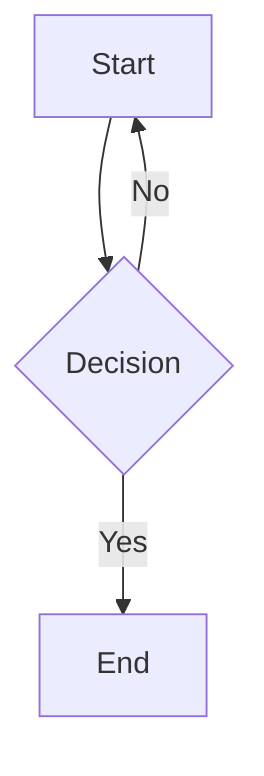

# Gloss VS Code Extension — Manual Testing Guide

> Version 0.3.0 | Last updated: 2026-03-11

## Prerequisites

1. **Launch the Extension Development Host**:
   ```bash
   cd extension
   npm install
   npm run compile
   # Press F5 in VS Code to launch Extension Development Host
   ```

2. **Test content** — have a workspace folder with markdown files. Ideally:
   - A folder with 5+ `.md` files (nested subfolders with images are a bonus)
   - At least one file with YAML frontmatter (`---` delimited)
   - At least one file with mermaid diagrams, KaTeX math, and code blocks
   - A file with relative-pathed images (`./images/photo.png`, `../assets/diagram.png`)
   - A file with HTML comments (`<!-- ... -->`) both with and without preceding blank lines
   - A file with LaTeX escaped underscores (`$x\_1$`, `$$F\_n$$`)

   If you don't have these, use the `gloss/` repo itself — `CLAUDE.md`, `gloss-project-plan.md`, and this `README.md` are good candidates. Create a scratch test file with the specific patterns below.

---

## 1. Extension Activation & Configuration

| # | Test | Expected | Pass |
|---|------|----------|------|
| 1.1 | Open a `.md` file in the workspace | Gloss auto-opens reading panel, source tab closes | |
| 1.2 | Check status bar | "Gloss: Reading Mode" indicator visible (if `showStatusBar` is true) | |
| 1.3 | Run `Gloss: Toggle Reading Mode` command | Status bar toggles, `.md` files stop/start auto-opening | |
| 1.4 | Set `gloss.enabled: false` in settings | Markdown files open in normal editor | |
| 1.5 | Add pattern to `gloss.exclude` (e.g. `**/CHANGELOG.md`) | Excluded file opens in editor, others in Gloss | |
| 1.6 | Set `gloss.zenMode: true` | Opening a markdown file also triggers VS Code Zen Mode | |
| 1.7 | Set `gloss.closeSourceTab: false` | Source editor tab stays open alongside the preview | |

---

## 2. Reading Panel Basics

| # | Test | Expected | Pass |
|---|------|----------|------|
| 2.1 | Open a `.md` file | Panel shows toolbar with filename + "Edit" button | |
| 2.2 | Click "Edit" button in toolbar | Source file opens in editor | |
| 2.3 | Press `Cmd+Shift+E` | Same as clicking Edit | |
| 2.4 | Open same file again while panel is open | Existing panel brought to focus (no duplicate) | |
| 2.5 | Open a different `.md` file | New panel created in same column | |
| 2.6 | Panel title | Shows `📖 filename` (without extension) | |

---

## 3. Document Rendering

### 3a. Basic Rendering

| # | Test | Expected | Pass |
|---|------|----------|------|
| 3.1 | Headings (h1–h6) | All levels render with correct sizes, h1 has bottom border | |
| 3.2 | Bold, italic, strikethrough | Inline formatting renders correctly | |
| 3.3 | Bullet lists, numbered lists | Lists render with proper indentation | |
| 3.4 | Links `[text](url)` | Render as clickable teal links | |
| 3.5 | Images `` with absolute path | Images render correctly | |
| 3.6 | Blockquotes `>` | Styled with left teal border | |
| 3.7 | Horizontal rules `---` | Renders as separator line | |
| 3.8 | Tables | Renders with borders, header row styled, alternating rows | |

### 3b. Code

| # | Test | Expected | Pass |
|---|------|----------|------|
| 3.9 | Inline code `` `code` `` | Monospace with code background | |
| 3.10 | Fenced code block (` ```js `) | Syntax highlighted with highlight.js | |
| 3.11 | Hover over code block | Copy button appears in top-right corner | |
| 3.12 | Click copy button | Code copied to clipboard, button shows "Copied!" | |
| 3.13 | Inline code with angle brackets `` `List<String>` `` | Renders as literal text, not swallowed as HTML | |
| 3.14 | Code block with `<template>` tags | Angle brackets escaped correctly | |

### 3c. Task Lists

| # | Test | Expected | Pass |
|---|------|----------|------|
| 3.15 | `- [ ] unchecked item` | Checkbox + text on same line, no list bullet | |
| 3.16 | `- [x] checked item` | Checked checkbox + text on same line, no bullet | |
| 3.17 | Mixed task list and normal list | Task items lack bullets, normal items keep theirs | |

### 3d. Mermaid Diagrams

| # | Test | Expected | Pass |
|---|------|----------|------|
| 3.18 | Open a file with ` ```mermaid ` block | Diagram renders as SVG (not raw text) | |
| 3.19 | Flowchart, sequence, gantt types | Various diagram types render | |
| 3.20 | Dark mode mermaid | Diagram adapts to VS Code dark theme | |

### 3e. KaTeX Math

| # | Test | Expected | Pass |
|---|------|----------|------|
| 3.21 | Inline math `$E = mc^2$` | Renders as formatted equation inline | |
| 3.22 | Display math `$$\int_0^1 x^2 dx$$` | Renders as centered block equation | |
| 3.23 | `\(...\)` and `\[...\]` delimiters | Both render as inline and display math respectively | |
| 3.24 | Escaped underscores `$x\_1 + x\_2$` | Renders literal underscores, NOT subscripts | |
| 3.25 | Display math with `\_`: `$$F\_n = F\_{n-1}$$` | Literal underscores preserved, not treated as subscripts | |
| 3.26 | Multiple inline math on one line `$a\_b$ and $c\_d$` | Both render correctly with literal underscores | |
| 3.27 | Math with `\text{max\_value}` | Underscore in text mode preserved | |
| 3.28 | No math in file → check page source | KaTeX CDN not loaded (conditional loading) | |

### 3f. Heading Anchors

| # | Test | Expected | Pass |
|---|------|----------|------|
| 3.29 | Hover over any heading | `#` anchor link appears to the left | |
| 3.30 | Click the `#` anchor | Page scrolls to that heading | |
| 3.31 | Headings get `id` attributes | Inspect DOM: slugified heading text as `id` | |
| 3.32 | Duplicate heading names | IDs deduplicated: `heading`, `heading-1`, etc. | |
| 3.33 | Anchor hidden in print | Cmd+P → anchors not visible in print output | |

### 3g. Frontmatter

| # | Test | Expected | Pass |
|---|------|----------|------|
| 3.34 | Open file with YAML frontmatter (`---` block) | Frontmatter is NOT shown in rendered output | |
| 3.35 | Content below frontmatter renders normally | Body text, headings, etc. all render | |

### 3h. HTML Comments

| # | Test | Expected | Pass |
|---|------|----------|------|
| 3.36 | `<!-- comment -->` with preceding blank line | Comment hidden (not rendered) | |
| 3.37 | `<!-- comment -->` WITHOUT preceding blank line | Comment still hidden (not rendered as text) | |
| 3.38 | `<!-- \newpage -->` page-break token inline after text | Invisible — not shown as text in output | |
| 3.39 | Multi-line comment `<!-- line1\nline2 -->` | Entirely hidden | |
| 3.40 | Comment inside fenced code block | Comment shown as literal text (not stripped) | |
| 3.41 | Multiple comments in succession | All hidden cleanly | |

### 3i. Images — Relative Paths (Bug Fix)

| # | Test | Expected | Pass |
|---|------|----------|------|
| 3.42 | Image with absolute path `` | Image loads | |
| 3.43 | Image with relative path `` | Image loads (resolved from markdown file's directory) | |
| 3.44 | Image with parent traversal `` | Image loads (resolved relative to file) | |
| 3.45 | Image with just filename `` in same folder | Image loads | |
| 3.46 | Image with URL-encoded spaces `` | Image loads (decoded correctly) | |
| 3.47 | Remote image `` | Loads from URL (not rewritten) | |
| 3.48 | Data URI image `` | Renders inline (not rewritten) | |
| 3.49 | Image in file opened outside workspace (standalone) | Still resolves relative to file directory | |
| 3.50 | Image path that doesn't exist | Broken image shown (no crash) | |

### 3j. External Links

| # | Test | Expected | Pass |
|---|------|----------|------|
| 3.51 | Click an `http://` or `https://` link | Opens in default browser | |

---

## 4. Find in Page

| # | Test | Expected | Pass |
|---|------|----------|------|
| 4.1 | Press `Cmd+F` | Find bar appears at top of document | |
| 4.2 | Type search term | Matches highlighted in yellow, current in teal | |
| 4.3 | `Cmd+G` or Enter | Navigate to next match | |
| 4.4 | `Shift+Cmd+G` or `Shift+Enter` | Navigate to previous match | |
| 4.5 | Match counter | Shows "X of Y" count | |
| 4.6 | Press Escape | Find bar closes, highlights cleared | |
| 4.7 | No matches | Counter shows "No matches" or "0 of 0" | |

---

## 5. Print

| # | Test | Expected | Pass |
|---|------|----------|------|
| 5.1 | Press `Cmd+P` in reading panel | Print dialog opens | |
| 5.2 | Print preview | No toolbar, find bar, copy buttons, or heading anchors | |
| 5.3 | Code blocks in print | Wrapped text, no overflow | |
| 5.4 | Headings in print | Don't break after heading (break-after: avoid) | |

---

## 6. Theme Awareness

| # | Test | Expected | Pass |
|---|------|----------|------|
| 6.1 | VS Code dark theme | Reading panel has dark background (#1e1e1e), light text | |
| 6.2 | VS Code light theme | Reading panel has white background, dark text | |
| 6.3 | Switch theme while panel is open | Panel re-renders with updated theme | |
| 6.4 | Code block highlighting | Uses `github-dark` in dark mode, `github` in light | |

---

## 7. Live Reload

| # | Test | Expected | Pass |
|---|------|----------|------|
| 7.1 | Edit the source file externally while panel is open | Panel re-renders with updated content | |
| 7.2 | Edit via "Edit" command, save, panel refreshes | Content updates automatically | |
| 7.3 | Rapid saves (3+ in quick succession) | Panel reflects final state | |

---

## 8. Keyboard Shortcuts

| # | Test | Expected | Pass |
|---|------|----------|------|
| 8.1 | `Cmd+Shift+E` in reading panel | Opens source file in editor | |
| 8.2 | `Cmd+F` in reading panel | Opens find bar | |
| 8.3 | `Cmd+P` in reading panel | Opens print dialog | |

---

## 9. Edge Cases

| # | Test | Expected | Pass |
|---|------|----------|------|
| 9.1 | Open empty `.md` file | Blank render, no crash | |
| 9.2 | Open very large `.md` file (1000+ lines) | Renders without hang | |
| 9.3 | File with broken YAML frontmatter | Renders content, frontmatter stripped gracefully | |
| 9.4 | File with only frontmatter (no body) | Panel shows toolbar, empty content area | |
| 9.5 | File with many duplicate heading names | Anchor IDs are deduplicated (`heading`, `heading-1`, …) | |
| 9.6 | Code block containing `<!-- comment -->` | Comment text shown literally (not stripped) | |
| 9.7 | Math block spanning many lines with `\_` throughout | All escaped underscores preserved | |
| 9.8 | Image with relative path and no workspace open | Resolves relative to file directory | |
| 9.9 | Deeply nested HTML comments `<!-- <!-- inner --> -->` | Outer comment stripped, no leftover visible text | |
| 9.10 | File with `%%MATH_BLOCK_0%%` literal text (collision test) | Rendered as-is when no math present; no false replacement | |
| 9.11 | Markdown file with CRLF line endings | All features work (frontmatter, comments, math) | |

---

## Summary

| Section | Tests | Priority |
|---------|-------|----------|
| 1. Activation & Config | 7 | High |
| 2. Reading Panel Basics | 6 | High |
| 3a. Basic Rendering | 8 | High |
| 3b. Code | 6 | High |
| 3c. Task Lists | 3 | Medium |
| 3d. Mermaid Diagrams | 3 | Medium |
| 3e. KaTeX Math | 8 | High |
| 3f. Heading Anchors | 5 | Medium |
| 3g. Frontmatter | 2 | High |
| 3h. HTML Comments | 6 | **High (new)** |
| 3i. Images — Relative Paths | 9 | **High (new)** |
| 3j. External Links | 1 | Low |
| 4. Find in Page | 7 | Medium |
| 5. Print | 4 | Medium |
| 6. Theme Awareness | 4 | High |
| 7. Live Reload | 3 | High |
| 8. Keyboard Shortcuts | 3 | Medium |
| 9. Edge Cases | 11 | Medium |
| **Total** | **96** | |

---

## Test File Template

Create a file called `gloss-test-fixture.md` with this content to hit all the new test cases:

````markdown
---
title: Gloss Test Fixture
tags: [test, rendering]
---

# Heading One

Some paragraph text before a comment with no blank line.
<!-- This comment should be invisible -->
Text continues after the hidden comment.

<!-- \newpage -->

## Heading Two

### Task Lists

- [ ] Unchecked task
- [x] Checked task
- Normal list item

### Images — Relative Paths


### KaTeX — Escaped Underscores

Inline: $x\_1 + x\_2 = y\_3$

Display math:
$$
F\_n = F\_{n-1} + F\_{n-2}
$$

Also: $\text{max\_value}$ and $\alpha\_i$

### Code with Angle Brackets

Inline: `List<String>` and `Map<K, V>`

```typescript
function identity<T>(arg: T): T {
  return arg;
}
// <!-- This comment is inside code and should be visible -->
```

### Heading Two

(Duplicate heading name — should get id `heading-two-1`)


````

Copy a small PNG image into the same directory as `test-image.png` to validate the relative path tests.
