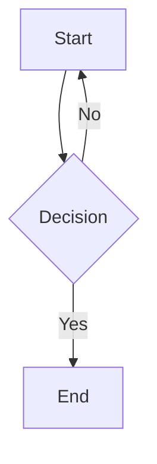

# Heading One

Some paragraph text before a comment with no blank line.
<!-- This comment should be invisible -->
Text continues after the hidden comment.

<!-- \newpage -->

## Heading Two

### Task Lists

- [ ] Unchecked task
- [x] Checked task
- Normal list item

### Images — Relative Paths


### KaTeX — Escaped Underscores

Inline: $x\_1 + x\_2 = y\_3$

Display math:
$$
F\_n = F\_{n-1} + F\_{n-2}
$$

Also: $\text{max\_value}$ and $\alpha\_i$

### Code with Angle Brackets

Inline: `List<String>` and `Map<K, V>`

```typescript
function identity<T>(arg: T): T {
  return arg;
}
// <!-- This comment is inside code and should be visible -->
```

### Heading Two

(Duplicate heading name — should get id `heading-two-1`)

### Mermaid Diagram



### Multiple Math Expressions

Given $x\_i$ for $i = 1, \ldots, n$ and $y\_j$ for $j = 1, \ldots, m$.

$$
\sum\_{i=1}^{n} x\_i = S
$$

### HTML Comments — Edge Cases

Text immediately before<!-- inline comment -->text immediately after.

<!-- Multi-line
comment that
spans lines -->

More text here.

```python
# This code block has a comment that should NOT be stripped:
# <!-- keep this visible -->
x = 42
```
