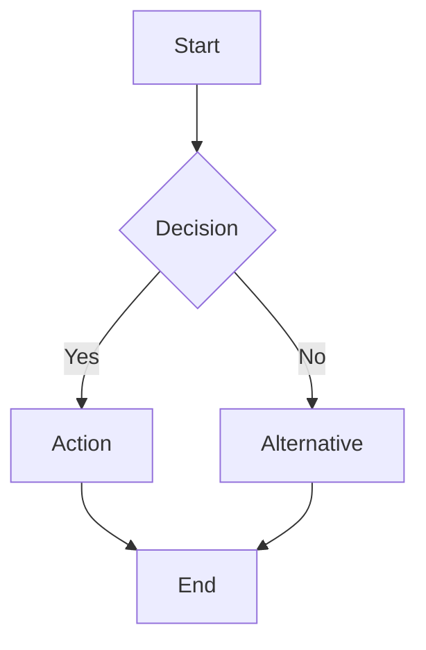
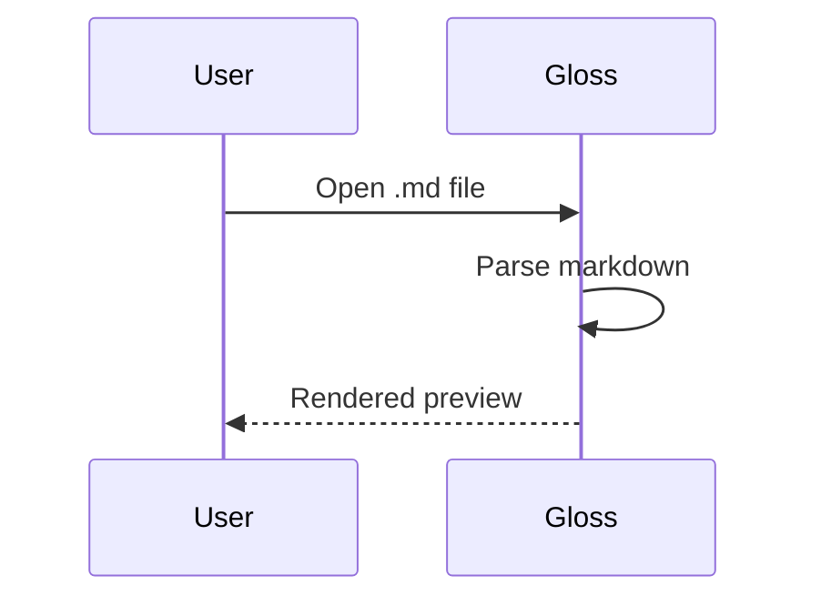

# TEST 1: Frontmatter

**PASS if:** This section heading is the first visible content. The YAML block above (title, author, tags) should NOT appear anywhere in the rendered output.

---

# TEST 2: Basic Rendering

## 2a. Inline Formatting

This text is **bold**. This text is _italic_. This text is **_bold and italic_**. This text is ~~strikethrough~~.

**PASS if:** Bold, italic, bold+italic, and strikethrough all render with correct styling.

## 2b. Links

Here is a [link to Google](https://www.google.com) and here is a [link to GitHub](https://github.com).

**PASS if:** Links render in teal and are clickable.

## 2c. Blockquote

> This is a blockquote. It should have a teal left border.
>
> It can have multiple paragraphs.

**PASS if:** Blockquote has a visible teal/accent left border.

## 2d. Horizontal Rule

There should be a horizontal line below this paragraph.

---

**PASS if:** A visible separator line appears above this text.

## 2e. Lists

Bullet list:

- First item
- Second item
  - Nested item
  - Another nested
- Third item

Numbered list:

1. Step one
2. Step two
   1. Sub-step
   2. Sub-step
3. Step three

**PASS if:** Bullets and numbers render with proper indentation at each level.

## 2f. Table

| Feature   | Status | Notes       |
| --------- | ------ | ----------- |
| Rendering | Done   | All formats |
| Math      | Done   | KaTeX       |
| Diagrams  | Done   | Mermaid     |

**PASS if:** Table has borders, styled header row, and alternating row colors.

---

# TEST 3: Code

## 3a. Inline Code

Here is `inline code` in a sentence. Here is `List<String>` with angle brackets. And `Map<K, V>` too.

**PASS if:** All three render as monospace with code background. Angle brackets show literally as `<String>` and `<K, V>`, NOT swallowed as HTML.

## 3b. Fenced Code Block

```typescript
function identity<T>(arg: T): T {
  return arg;
}

interface Config<T> {
  value: T;
  label: string;
}

const x: Array<number> = [1, 2, 3];
```

**PASS if:** Syntax highlighted with colors. Hover shows a copy button in the top-right corner. Click copy button — it says "Copied!" and content is in clipboard.

## 3c. Code Block with HTML-like Content

```html
<template>
  <div class="container">
    <!-- This HTML comment is inside a code block -->
    <p>Hello {{ name }}</p>
  </div>
</template>
```

**PASS if:** All angle brackets, the HTML comment, and template syntax render as visible literal text inside the code block. Nothing is stripped or hidden.

---

# TEST 4: Task Lists

- [ ] This is an unchecked task
- [ ] Another unchecked task
- [x] This task is complete
- [x] This one too

Mixed with normal list:

- Normal bullet item
- [ ] Task item in the middle
- Another normal item
- [x] Completed task

**PASS if:** Checkboxes appear on the same line as text. No bullet markers on task items. Normal items keep their bullets. Checked items show filled checkboxes.

---

# TEST 5: HTML Comments

This paragraph comes before a comment with no blank line.

<!-- This comment should be invisible — no blank line before it -->

This text should flow right after the paragraph above.

<!-- This comment has a preceding blank line -->

The comment above (with blank line) should also be invisible.

Text before<!-- inline comment -->text after — should be seamless.

<!--
Multi-line comment
spanning several lines
should be completely hidden
-->

<!-- first --><!-- second --><!-- third -->

All three comments above should be invisible — no gaps or artifacts.

<!-- \newpage -->

The pagebreak directive above should be invisible.

```python
# This code block has a comment that must STAY visible:
x = 42  # <!-- this is in code, keep it -->
```

**PASS if:** No comment text is visible anywhere except inside the Python code block. Text flows naturally around where comments were. The `<!-- this is in code, keep it -->` line IS visible inside the code block.

---

# TEST 6: KaTeX Math

## 6a. Inline Math

Einstein's famous equation: $E = mc^2$

The quadratic formula: $x = \frac{-b \pm \sqrt{b^2 - 4ac}}{2a}$

**PASS if:** Both render as formatted math (not raw dollar-sign text).

## 6b. Display Math

$$\int_0^1 x^2 \, dx = \frac{1}{3}$$

$$\sum_{i=1}^{n} i = \frac{n(n+1)}{2}$$

**PASS if:** Both render as centered block equations with proper integral/summation notation.

## 6c. Alternate Delimiters

Inline with parens: \(a^2 + b^2 = c^2\)

Display with brackets:
\[
\lim\_{x \to \infty} \frac{1}{x} = 0
\]

**PASS if:** Both render as formatted math, same as dollar-sign versions.

## 6d. Escaped Underscores (Key Bug Fix)

Inline: $x\_1 + x\_2 = y\_3$

Display:
$$F\_n = F\_{n-1} + F\_{n-2}$$

Text mode: $\text{max\_value}$

Multiple on one line: $a\_b$ and $c\_d$ and $\alpha\_i$

**PASS if:** All underscores render as LITERAL underscores (visible `_` characters), NOT as subscripts. `x\_1` should show as `x_1` with a flat underscore, not x with subscript 1.

## 6e. Many-Line Math with Escaped Underscores

$$
\begin{aligned}
x\_1 &= \alpha\_0 + \beta\_1 \\
x\_2 &= \alpha\_1 + \beta\_2 \\
x\_3 &= \alpha\_2 + \beta\_3
\end{aligned}
$$

**PASS if:** All `\_` render as literal underscores across all three lines. No subscripts.

---

# TEST 7: Heading Anchors

Hover over any heading on this page. A `#` symbol should fade in to the left of the heading text.

## Subheading for Anchor Test

### Another Level for Testing

**PASS if:** Hovering over "TEST 7", "Subheading for Anchor Test", and "Another Level for Testing" all show a `#` anchor link. Clicking it scrolls/jumps to that heading.

---

# TEST 8: Duplicate Heading Names

## Duplicate

First instance of "Duplicate" heading.

## Duplicate

Second instance — this heading's anchor ID should be `duplicate-1` (deduplicated).

**PASS if:** Both headings render. Clicking the `#` anchor on each scrolls to the correct one (they don't collide).

---

# TEST 9: Mermaid Diagrams





**PASS if:** Both diagrams render as visual SVG graphics (not raw mermaid text). Flowchart shows boxes and arrows. Sequence diagram shows participants and message arrows. In dark mode, diagrams adapt to dark theme colors.

---

# TEST 10: Images

## 10a. Same-Folder Relative Path


**PASS if:** Image loads (small PNG visible).

## 10b. Filename Only


**PASS if:** Same image loads.

## 10c. Nonexistent Image


**PASS if:** Broken image icon shown. No crash.

## 10d. Remote Image


**PASS if:** Teal placeholder image loads from the internet (if online).

## 10e. Data URI Image


**PASS if:** A tiny red square renders inline. Not rewritten or broken.

---

# TEST 11: External Links

Click this link: [Open Google](https://www.google.com)

**PASS if:** Opens in your default browser, NOT inside the Gloss panel.

---

# TEST 12: Find in Page

Press **Cmd+F** (or Ctrl+F) now.

Search for the word "PASS" — it appears many times in this document.

**PASS if:** Find bar appears at top. Matches highlighted in yellow, current match in teal. Cmd+G moves to next match. Escape closes the bar.

---

# TEST 13: Print

Press **Cmd+P** now.

**PASS if:** Print dialog opens. In the preview: no toolbar, no find bar, no copy buttons, no heading anchor `#` symbols. Code blocks wrap text. Light background regardless of current theme.

---

# TEST 14: Theme

Switch between a dark and light VS Code theme (Cmd+K Cmd+T).

# EDIT!

**PASS if:** Panel background changes (dark: #1e1e1e, light: white). Code highlighting switches between `github-dark` and `github` styles. All text remains readable.

---

# TEST 15: Live Reload

Open this file's source in an editor side-by-side. Add a line like "LIVE RELOAD WORKS" below, save, and check the panel.

**PASS if:** Panel updates automatically after save without needing to reopen.

---

# TEST 16: Edge Cases

## 16a. Placeholder Collision

This file contains the literal text %%MATH_BLOCK_0%% — it should render as-is when no math context applies to it.

**PASS if:** The text `%%MATH_BLOCK_0%%` appears literally. (Note: since this file DOES have math, this tests that the placeholder doesn't collide with actual math block indices.)

## 16b. Empty Section

**PASS if:** No crash rendering this empty section.
