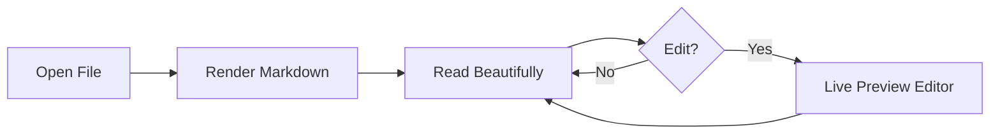

# Welcome to Gloss

Gloss is a distraction-free markdown reader for macOS. Open any `.md` file and see it beautifully rendered — no editing distractions, no clutter. This guide walks through everything Gloss can do.

## Beautiful Rendering

Every markdown feature you'd expect, rendered cleanly:

- **Bold**, *italic*, ~~strikethrough~~, and `inline code`
- Block quotes, ordered and unordered lists
- Tables, horizontal rules, and task lists
- Heading anchors — hover any heading to see a link icon

> "The purpose of a reader is to let you focus on what matters: the words."

## Syntax Highlighting

Code blocks are highlighted automatically with full language support. Hover any block to reveal a one-click copy button.

```swift
struct ContentView: View {
    var body: some View {
        Text("Hello, Gloss!")
            .font(.title)
            .padding()
    }
}
```

```javascript
// Languages are detected automatically
function fibonacci(n) {
    if (n <= 1) return n;
    return fibonacci(n - 1) + fibonacci(n - 2);
}
```

```python
# Python, Ruby, Rust, Go, and many more
def greet(name: str) -> str:
    return f"Hello, {name}!"
```

## Diagrams & Math

Gloss renders **Mermaid diagrams** directly in your markdown:



And **LaTeX math** via KaTeX — both inline ($E = mc^2$) and display:

$$
\sum_{i=1}^{n} i = \frac{n(n+1)}{2}
$$

## Edit Mode

Toggle edit mode with **⇧⌘E** to switch to a live-preview editor powered by CodeMirror 6:

- Markdown syntax hides on unfocused lines (Obsidian-style)
- Headings render at their actual sizes
- Links display as styled text
- Checkboxes are interactive
- Auto-saves when you switch back to reading mode or press **⌘S**

## Inspector Sidebar

Open the Inspector with **⌥⌘I** to see:

- **Table of Contents** — click any heading to jump to it
- **Frontmatter** — parsed YAML metadata at a glance
- **Tags** — clickable pills for the current document's tags
- **Backlinks** — every document that links to this one, grouped by link type

## Folder Sidebar

Open a folder with **⇧⌘O** to browse all your markdown files:

- **Tree view** — expand and collapse directories
- **Full-text search** — find content across every file in your vault
- **Recents** — quickly revisit recently opened documents
- **Favorites** — starred files always accessible at the top
- **Tags** — browse all tags in your vault with file counts

## Wiki-Links & Backlinks

Link between documents using wiki-link syntax:

- `[[another-file]]` — navigates to the file within your folder
- `[[target|display text]]` — custom display text
- `[[target::related]]` — typed link for categorized relationships

The Inspector's backlinks panel shows every document that links back to the one you're reading, grouped by relationship type.

## Tags

Add tags to your YAML frontmatter:

```yaml
---
tags: [project, idea, draft]
---
```

Tags appear as clickable pills in the Inspector and are browsable in the sidebar. Click any tag to filter your file tree to just the files with that tag.

## Keyboard Navigation

Vim-style keys work in reading mode:

| Key | Action |
|-----|--------|
| `j` / `k` | Scroll down / up |
| `gg` | Jump to top |
| `G` | Jump to bottom |
| `⌘F` | Find in page |
| `⌘G` | Find next match |
| `⇧⌘G` | Find previous match |

## Export & Productivity

- **⌘P** — Print the current document
- **⌘E** — Export as PDF
- **⌘\\** — Zen mode (hide sidebar and window chrome)
- **⌘D** — Toggle favorite on the current document
- **⌘,** — Open Settings (appearance, editor, font size)

## Quick Look

Gloss includes a Quick Look extension. Press **Space** on any `.md` file in Finder for an instant rendered preview — no need to open the app.

## What's Next?

- Open a **folder** (`⇧⌘O`) to explore your markdown collection
- Try **Edit mode** (`⇧⌘E`) for a distraction-free writing experience
- Open the **Inspector** (`⌥⌘I`) to see this document's structure and tags
- **Star** this document (`⌘D`) to try favorites
- Revisit this tour anytime from **Help → Getting Started Tour**

Happy reading!
